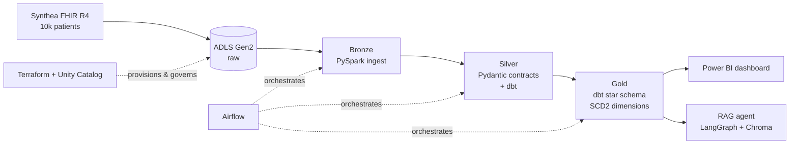
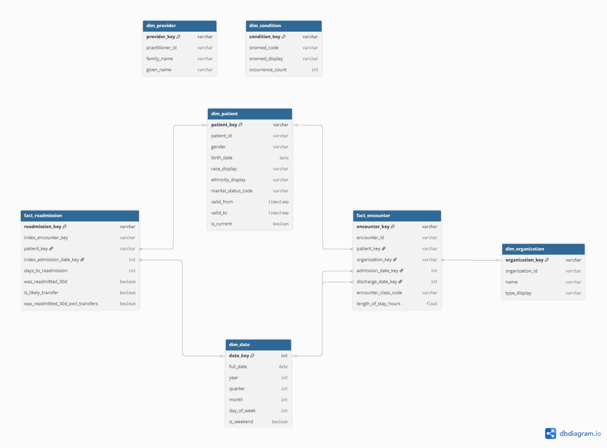
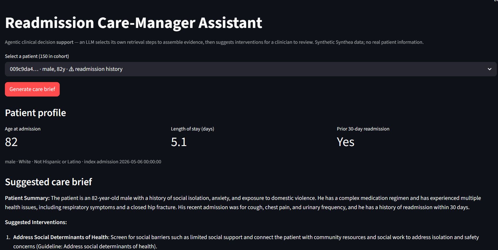
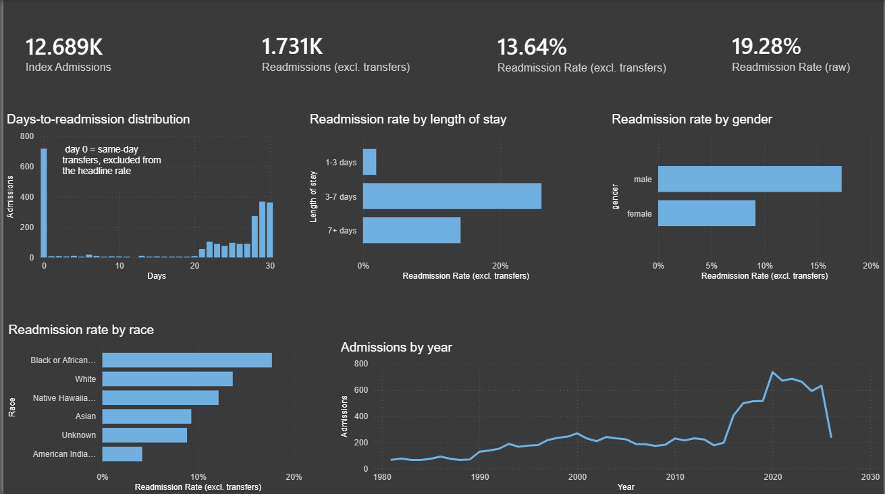

# Readmission Lakehouse — End-to-End Data Engineering on Azure

> A production-style data engineering platform on a Databricks lakehouse: it ingests FHIR clinical records through a governed medallion pipeline, models them into a tested dimensional warehouse, orchestrates the run with Airflow, and serves the result through a Power BI dashboard and a deployed, zero-secrets AI agent. The use case — 30-day hospital readmission risk — stands in for any "predict and explain a costly repeat event" problem (churn, fraud, failure).

[](https://github.com/ibralhindi/readmission-lakehouse/actions/workflows/ci.yml)


As a concrete end-to-end result, the platform computes a **13.64%** 30-day readmission rate across **12,689 index admissions** (transfer-excluded; 19.28% raw). These are presented in a Power BI dashboard, screenshot included below.

**Live agent demo:** [Open the live agent](https://rl-agent-dev.greendune-bd3f68cb.australiaeast.azurecontainerapps.io/) — public, runs on synthetic data, scales to zero so the first request may cold-start for ~30–60s.

---

## Contents
  - [The problem](#the-problem)
  - [What it does](#what-it-does)
  - [Architecture](#architecture)
  - [Results](#results)
  - [Tech stack](#tech-stack)
  - [Engineering highlights](#engineering-highlights)
  - [The AI agent](#the-ai-agent)
  - [Dashboard](#dashboard)
  - [Running it locally](#running-it-locally)
  - [Scope, limitations & production roadmap](#scope-limitations--production-roadmap)
  - [Built with AI assistance](#built-with-ai-assistance)
  - [License](#license)

---

## The problem

Unplanned 30-day hospital readmissions are expensive and, in many health systems, financially penalized. In the US, the CMS Hospital Readmissions Reduction Program docks payments for excess readmissions. The analytical question is: *given an admission's history and context, how likely is the patient to come back within 30 days, and what's driving that risk?*

That question is a specific instance of a pattern that recurs across almost every industry: **predicting and explaining a costly repeat-event from an entity's history.** Swap the nouns and the pipeline is the same shape.

| This project | Generalizes to |
|---|---|
| patient → readmission | customer → churn |
| admission history | transaction / usage history |
| risk drivers | churn / fraud / failure drivers |

The project is framed in healthcare, but the engineering — contract-validated ingestion, a governed dimensional model, an event-windowing fact table, orchestration, and an explanation layer — transfers directly to any domain built on entity event-histories.

## What it does

- **Ingests** raw FHIR R4 clinical records and lands them through a **medallion architecture** (bronze → silver → gold) on Azure Data Lake Storage and Delta Lake.
- **Validates** records against **data contracts** (Pydantic models of the FHIR resources), quarantining anything that fails rather than letting it corrupt downstream tables.
- **Models** a **star schema** with conformed dimensions and **SCD2 history** on the dimensions that change over time.
- **Computes** the 30-day readmission fact, including transfer-exclusion logic so inter-facility transfers aren't miscounted as readmissions.
- **Orchestrates** the pipeline end-to-end with **Apache Airflow**.
- **Provisions** all cloud infrastructure with **Terraform** and governs data access with **Unity Catalog**.
- **Serves** insight two ways: a **Power BI** dashboard for analysts, and an **agentic RAG assistant** that drafts a structured readmission-risk brief for any patient.
- **Ships** through **CI/CD** (GitHub Actions) and a **containerized, zero-secrets deployment**. The agent runs in Azure Container Apps under a managed identity that reads every secret from Key Vault, so nothing sensitive lives in the image, the repo, or the container's environment.

## Architecture



The dimensional model:



Data flows from synthetic FHIR records into raw storage, through PySpark bronze ingestion, into a contract-validated silver layer, and finally into a dbt-built gold star schema that both the dashboard and the agent read from. Airflow orchestrates the run; Terraform provisions every resource; Unity Catalog governs catalogs, schemas, and external locations.

## Results

| Metric | Value |
|---|---|
| Index admissions | 12,689 |
| 30-day readmissions | 1,731 |
| **Readmission rate (transfer-excluded)** | **13.64%** |
| Readmission rate (raw, for comparison) | 19.28% |
| `fact_encounter` rows | 664,623 |
| dbt build | 15 models · 3 snapshots · 69 tests — all passing |

The ~5.6-point gap between the raw and transfer-excluded rates is itself a finding: naively counting any subsequent admission as a readmission materially overstates the rate, because inter-facility transfers look like rapid readmissions but aren't. The transfer-exclusion logic in `fact_readmission` is what makes the headline number trustworthy.

## Tech stack

| Layer | Tools |
|---|---|
| Language & tooling | Python 3.12, uv, ruff, mypy, pre-commit |
| Source data | Synthea (FHIR R4), 10,000 synthetic patients, seed = 42 |
| Storage & processing | Azure Data Lake Storage Gen2, Delta Lake, Databricks (DBR 17.3), PySpark 3.5 |
| Validation | Pydantic data contracts |
| Transformation | dbt (dbt-databricks) — silver + gold models, snapshots, tests |
| Orchestration | Apache Airflow 3.2 (local Docker) |
| Infrastructure & governance | Terraform (azurerm), Unity Catalog |
| AI / RAG | LangGraph, LangChain, Chroma, OpenAI (`text-embedding-3-small`, `gpt-4o-mini`) |
| Serving | Streamlit, Azure Container Registry, Azure Container Apps |
| BI | Power BI Desktop |
| CI/CD | GitHub Actions |

## Engineering highlights

A few decisions worth calling out, with the reasoning behind them:

- **Medallion architecture with enforced contracts.** Bronze preserves raw fidelity; silver validates each record against a Pydantic model of the FHIR resource and quarantines failures with a reason, so a malformed record degrades one row instead of poisoning the table. Validation exceptions are caught narrowly (`ValidationError`) so genuine bugs fail fast rather than being silently quarantined.
- **Point-in-time correctness via SCD2 as-of joins.** Patient, organization, and practitioner dimensions capture history through dbt snapshots. `fact_encounter` joins each encounter to the **patient-dimension version valid at admission time** (an as-of join on the SCD2 validity window) so a fact sees the dimension as it was when the event happened, not as it is now. The stable organization reference uses a current-version join: a deliberate mixed pattern (as-of where history matters, current for stable references). The practitioner join is deferred, since encounters reference practitioners by NPI rather than resource id.
- **Transfer-aware readmission logic.** The readmission fact excludes inter-facility transfers, which would otherwise inflate the rate — the difference between a defensible 13.64% and a misleading 19.28%.
- **Tested transformations.** 69 dbt tests (uniqueness, not-null, referential integrity, accepted values) plus a Python unit suite gate the pipeline; CI runs `dbt parse` offline so model validity is checked without warehouse credentials.
- **Everything as code.** All Azure and Databricks resources are provisioned with modular Terraform; Unity Catalog governs data access through storage credentials and external locations rather than account keys.
- **Zero-secrets deployment.** The agent is containerized and deployed to Azure Container Apps under a **user-assigned managed identity**. `DefaultAzureCredential` resolves to that identity in the cloud (and to a developer login locally — the same code path), pulls the image from a private registry (AcrPull), and reads the OpenAI key and Databricks service-principal secret from Key Vault (Key Vault Secrets User). No secret exists in the image, the repository, or the container's environment.
- **CI/CD and security scanning.** GitHub Actions runs lint, type-checks, tests, and `dbt parse` on every push, with a separate Terraform `fmt`/`validate` job; the git history was scanned for leaked secrets before publishing.

## The AI agent

The agent answers a practical question a care manager would ask: *"What should I know about this patient's readmission risk?"*

It's a genuine **tool-calling agent** built with LangGraph. The model is given tools and a goal, decides which to call, formulates its own search queries, retrieves again if a pass is thin, and decides when it has enough to write. Control flow is model-directed, not a fixed pipeline. It's framed as **decision support**: it suggests, a human clinician decides. Its three tools:

1. **Patient profile** — the structured facts from the **gold** layer via the Databricks SQL warehouse: demographics, the latest inpatient index admission, length of stay, and the 30-day readmission outcome. (Diagnoses and clinical detail deliberately aren't here; they live in the notes, retrieved below.)
2. **Clinical-note search** — semantic search over the patient's own clinical notes (FHIR `DocumentReference` text), embedded into a **Chroma** vector store with OpenAI `text-embedding-3-small`.
3. **Guideline search** — semantic search over a small library of evidence-based intervention guidelines.

It then drafts a structured, grounded brief with `gpt-4o-mini`, citing the guideline titles it draws on rather than free-associating. The agent is served through a Streamlit UI and deployed to Azure Container Apps; patient identifiers are validated as UUIDs before they touch any query.



## Dashboard



An Import-mode Power BI dashboard over the gold star schema: the headline readmission rate, breakdowns by patient and clinical attributes, and the drivers behind the risk.

## Running it locally

**Prerequisites:** Python 3.12, [uv](https://docs.astral.sh/uv/), Docker, the Databricks CLI, an Azure subscription, a Databricks workspace, and an OpenAI API key.

```bash
# 1. install dependencies + pre-commit hooks
make install

# 2. provision infrastructure (review the plan first)
cd terraform/environments/dev
terraform init
terraform apply -var-file=terraform.tfvars
```

**3. Prepare the source data.** Generate a Synthea FHIR R4 dataset with the included `synthea.properties` (Massachusetts, seed 42, population 10,000, FHIR NDJSON bulk export), then upload it to ADLS:

```bash
./scripts/upload-synthea-to-adls.sh
```

**4. Deploy the Databricks jobs** (bronze ingestion + silver validation) from the asset bundle:

```bash
databricks bundle deploy -t dev
```

**5. Run the pipeline.** The `readmission_pipeline` Airflow DAG orchestrates it end to end, it triggers the bronze and silver Databricks jobs, then runs `dbt build` (silver models + SCD2 snapshots + gold star schema + tests):

```bash
docker compose -f airflow/docker-compose.yaml up   # then trigger the DAG (manual schedule)
```

> The DAG authenticates to Databricks via the `databricks_default` connection and reads the service-principal secret from the Airflow Variable `databricks_sp_client_secret` (set both before triggering). To iterate on transforms alone, run `cd dbt && dbt build` directly.

**6. Run the agent.**

```bash
python -m readmission_lakehouse.agent.corpus   # builds the local .chroma vector store
uv run --group rag streamlit run src/readmission_lakehouse/agent/app.py
```

> **Note:** the vector store (`.chroma/`) is generated locally and not committed; run the corpus step before building the image, which bakes it in.

Secrets are never read from the repo: locally the agent authenticates to Key Vault via your `az login` session; in the cloud it uses its managed identity. Non-secret identifiers come from a local `.env` (see `agent/.env.example`).

## Scope, limitations & production roadmap

This is a portfolio project deliberately scoped to a single environment and a tractable dataset. The trade-offs below were intentional; the right-hand column is what a production build would add.

| Deliberate scope here | Production would add |
|---|---|
| Single (`dev`) environment with identifiers in config | Multi-environment promotion via Terraform workspaces, dbt/bundle targets, and Airflow Variables/Connections |
| Data contracts on the clinical entities on the readmission critical path; `Observation`/`MedicationRequest` pass through with schema-on-read | Full contract coverage with explicit quarantine for every entity |
| Practitioner dimension join deferred (encounters reference practitioners by NPI, not resource id) | NPI extraction on both sides to wire up `dim_provider` |
| Synthetic, copyright-free clinical-guideline summaries as the RAG corpus | Integration of licensed, citable guideline sources |
| Vector store baked into the image / regenerated from the corpus builder | Vector store served from managed storage and refreshed on a schedule |
| Public, unauthenticated demo endpoint | Entra ID (EasyAuth) authentication and per-user rate limits |
| Descriptive readmission analytics | A trained predictive model with monitoring and feature lineage |

Naming these isn't an admission of gaps so much as a map of the boundary between "demonstrate the engineering" and "operate a production system."

## Built with AI assistance

This project was built with AI pair-programming (Claude and Cursor). The architecture decisions, the core logic, and the engineering judgment are my own; the AI accelerated the parts that are well-trodden and surfaced things to verify rather than guess.

## License

[MIT](LICENSE)
